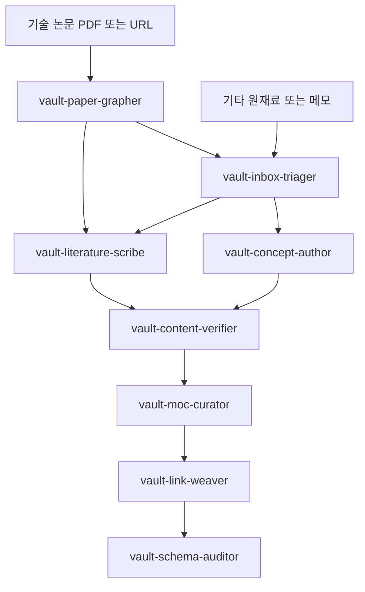
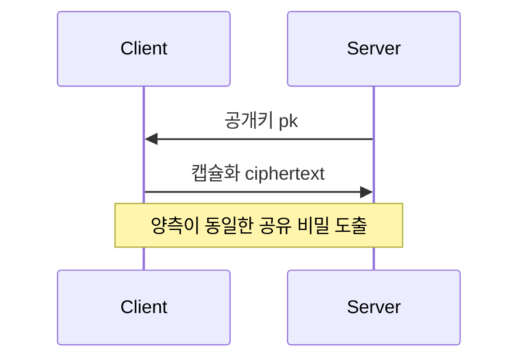

# 양자정보과학 제2의 뇌 (Zettelkasten x PARA) 지침

이 파일은 AI 에이전트가 이 Obsidian vault에서 노트를 생성하고 수정하고 연결할 때 반드시 따르는 운영 지침이다.
사람이 읽는 본문 서사는 자연스럽게, AI가 파싱하는 구조와 메타데이터는 기계적으로 일관되게 유지한다.

<vault-identity>
## 정체성

- 이 vault는 양자정보과학(Quantum Information Science) 전반을 기록하는 개인 지식 베이스("제2의 뇌")다.
- 다루는 범위: 양자컴퓨팅, 양자정보이론, 양자암호(QKD/QRNG), 양자 내성 암호(PQC), 양자 알고리즘, 양자 오류정정, 양자 하드웨어와 통신.
- 방법론: 제텔카스텐(Zettelkasten)으로 지식을 원자화하고, PARA로 실행 가능성에 따라 분류한다.
- 환경: Obsidian. 양방향 링크(`[[...]]`), 프론트매터(Properties), Dataview, Bases, Excalidraw, Smart Connections 사용.
- 언어: 본문 서사는 한국어. 기술 용어와 노트 제목은 표준 영문 명칭을 우선 사용하고 한국어 별칭(aliases)을 병기한다.
</vault-identity>

<core-principles>
## 핵심 원칙

<principle name="원자성 (Atomicity)">
하나의 노트는 하나의 개념만 담는다. 거대한 글을 만들지 않는다.
- 나쁜 예: "국가기관용 양자 내성 암호 통신망 구축 가이드" 단일 문서.
- 좋은 예: [[Kyber (ML-KEM)]], [[Dilithium (ML-DSA)]], [[Hybrid Key Exchange]]로 쪼개고 각각을 링크로 연결.
- 판단 기준: "이 노트를 다른 맥락에서 재사용할 수 있는가?" 재사용 불가능하면 더 쪼갠다.
- 한 노트가 두 개 이상의 독립 개념을 설명하려 하면 분리하고 양방향 링크로 잇는다.
</principle>

<principle name="연결 우선 (Link First)">
폴더가 아니라 링크가 지식을 조직한다. 폴더는 PARA 실행 가능성 분류에만 쓰고, 개념 간 관계는 `[[위키링크]]`, MOC, 태그로 표현한다.
- 새 노트를 만들면 최소 1개 이상의 기존 노트와 연결한다(고아 노트 금지).
- 링크는 본문 문맥 속에 자연스럽게 녹이고, 노트 끝 `## 연결` 섹션에 관계의 의미를 명시한다.
</principle>

<principle name="기계-인간 이중성 (Dual Readability)">
- 구조와 메타데이터(프론트매터, 태그, 파일명, 링크): AI가 결정적으로 파싱하도록 스키마를 엄격히 준수.
- 본문 서사: 사람이 읽기 쉽게 맥락과 흐름을 갖춘 한국어 산문으로.
</principle>

<principle name="성장하는 노트 (Evergreen)">
노트는 완성품이 아니라 성숙해 가는 대상이다. `status` 프로퍼티로 성숙도를 표시한다. 성숙은 seedling에서 budding을 거쳐 evergreen으로 진행한다.
</principle>
</core-principles>

<directory-structure>
## 디렉터리 구조 (PARA + 진입점)

- `quantum-information/`
  - `CLAUDE.md`
  - `+ Maps/` MOC(Map of Content) 진입점이자 vault의 지식 지도
  - `0 - Inbox/` fleeting 및 미분류 노트 임시 보관, 가공 후 이동
  - `1 - Projects/` PARA-P, 마감과 목표가 있는 능동적 작업
  - `2 - Areas/` PARA-A, 지속적으로 관리하는 책임 영역
  - `3 - Resources/` PARA-R, 주제별 원자 노트 본체이자 vault의 핵심
    - `Post-Quantum-Cryptography/`
    - `Quantum-Computing/`
    - `Quantum-Information-Theory/`
    - `Quantum-Cryptography/` QKD, QRNG 등
    - `Quantum-Algorithms/`
    - `Quantum-Error-Correction/`
    - `Quantum-Hardware/`
  - `4 - Archive/` PARA-Archive, 종료되거나 비활성인 항목
  - `_Meta/`
    - `Templates/` 노트 템플릿
    - `Attachments/` 이미지, Excalidraw, 첨부

<rules>
- 폴더 깊이는 얕게 유지한다. Resources 하위 1단계 도메인 분류까지만 둔다. 더 깊은 분류는 태그와 MOC로 처리.
- 개념 노트(`type: concept`)는 원칙적으로 `3 - Resources/` 도메인 폴더에 둔다.
- 새 정보가 들어오면 우선 `0 - Inbox/`에 두고, 원자화와 연결을 거쳐 적절한 PARA 폴더로 옮긴다.
- 프로젝트가 끝나면 결과물 중 재사용 가능한 개념은 Resources로 추출(extract)하고, 나머지는 Archive로 보낸다.
</rules>
</directory-structure>

<note-types>
## 노트 유형 (`type` 프로퍼티)

| type | 한국어 | 용도 | 위치 |
|------|--------|------|------|
| `concept` | 개념 노트(영구) | 원자적 개념 1개. vault의 기본 단위 | 3 - Resources |
| `moc` | 지식 지도 | 특정 주제의 진입점이자 허브. 링크 모음 | + Maps |
| `literature` | 문헌 노트 | 논문, 책, 강의 1개 출처 요약 | 3 - Resources 또는 출처별 |
| `fleeting` | 임시 노트 | 가공 전 메모와 아이디어 | 0 - Inbox |
| `project` | 프로젝트 노트 | 마감 있는 작업의 허브 | 1 - Projects |
| `area` | 영역 노트 | 지속 책임 영역 허브 | 2 - Areas |
| `claim` | 주장 노트 | 검증 대상 명제 1개(선택) | 3 - Resources |

원칙: 의심스러우면 `concept`로 만들고 더 잘게 쪼갤지 검토한다.
</note-types>

<frontmatter-schema>
## 프론트매터 스키마 (필수 준수)

모든 노트는 YAML 프론트매터로 시작한다. AI는 아래 필드명, 타입, enum 값을 정확히 사용한다.

```yaml
---
title: Kyber (ML-KEM)          # 표시 제목. 파일명과 일치(영문 표준 명칭)
aliases: [ML-KEM, CRYSTALS-Kyber, 키버]   # Obsidian 링크 해석용 별칭(한국어 포함)
type: concept                  # concept | moc | literature | fleeting | project | area | claim
status: evergreen              # seedling | budding | evergreen
domain: post-quantum-cryptography   # 아래 enum 1개
tags:                          # 계층형 태그(아래 taxonomy 참조)
  - pqc/kem
  - lattice/mlwe
  - nist/fips-203
created: 2026-05-30            # YYYY-MM-DD
updated: 2026-05-30            # 수정 시 갱신
up: "[[MOC - Post-Quantum Cryptography]]"   # 상위 MOC 또는 부모. 단일 링크
related:                       # 관련 노트 링크 목록
  - "[[Dilithium (ML-DSA)]]"
  - "[[Hybrid Key Exchange]]"
  - "[[Module-LWE]]"
source:                        # 출처(DOI, URL, 표준 번호). 없으면 생략
  - "NIST FIPS 203"
confidence: high               # low | medium | high  (내용 신뢰도)
---
```

<field-spec>
- `title` (string, 필수): 파일명과 동일. 기술 개념은 영문 표준 명칭.
- `aliases` (list, 권장): 한국어명, 약어, 이전 명칭. 링크 누락 방지의 핵심.
- `type` (enum, 필수): note-types 참조.
- `status` (enum, 필수): seedling(씨앗), budding(성장), evergreen(성숙) 순으로 성장.
- `domain` (enum, 필수): `quantum-computing` | `quantum-information-theory` | `quantum-cryptography` | `post-quantum-cryptography` | `quantum-algorithms` | `quantum-error-correction` | `quantum-hardware` | `quantum-communication` | `foundations`.
- `tags` (list, 필수): 최소 1개. 계층형. 도메인 외 세부 분류와 교차 주제 표현.
- `created` / `updated` (date, 필수): ISO `YYYY-MM-DD`.
- `up` (link, MOC 연결 권장): 가장 가까운 상위 MOC 또는 부모 개념.
- `related` (list of links, 권장): 수평 관계 노트.
- `source` (list, literature와 인용 시 필수): 표준 번호, DOI, URL.
- `confidence` (enum, 권장): 출처 검증 수준.
</field-spec>

원칙: 사람이 채우기 번거로운 정보일수록 AI가 정확히 채운다. enum 값은 임의로 추가하지 말고, 필요하면 이 스키마를 먼저 갱신한다.
</frontmatter-schema>

<tagging-taxonomy>
## 태그 분류 체계 (계층형)

태그는 `대분류/소분류` 형태로 계층화한다. domain이 큰 영역을, tag가 교차 속성과 세부 속성을 담당한다.

```
pqc/kem          pqc/signature      pqc/hash-based
lattice/mlwe     lattice/ntru       code-based/mceliece     code-based/hqc    isogeny    multivariate
nist/fips-203    nist/fips-204      nist/fips-205           nist/fips-206     nist/round-4
qkd/bb84         qkd/e91            qkd/error-correction    qkd/key-distillation    qrng
algorithm/shor   algorithm/grover   algorithm/qft
qec/surface-code qec/stabilizer     qec/ldpc                qec/motivation    qec/passive-protection
concept/entanglement   concept/superposition   concept/no-cloning      concept/qubit       concept/gate
concept/measurement    concept/operator        concept/state           concept/formalism   concept/postulate
concept/dynamics       concept/open-system     concept/nonlocality     concept/composite-system
hardware/superconducting   hardware/trapped-ion   hardware/photonic     hardware/josephson-junction
math/linear-algebra
threat/harvest-now-decrypt-later   threat/eavesdropping-detection   migration/hybrid
```

<rules>
- 신규 태그는 기존 계층에 맞춰 추가하고, 표기를 일관되게 유지한다(소문자와 하이픈).
- `domain` 이름(`foundations`, `quantum-computing`, `quantum-communication` 등)은 태그 접두로 쓰지 않는다. 영역은 `domain` 필드가 담당하고, 교차 개념은 `concept/*`로, 수학적 토대는 `math/*`로 표현한다.
- 위 목록은 예시이며 망라가 아니다. 새 소분류는 `concept/*` 같은 기존 교차 접두 아래에 의미 단위로 추가한다.
- 성숙도와 신뢰도는 태그가 아니라 `status`와 `confidence` 프로퍼티로 표현한다.
- 태그 남발 금지. 한 노트당 핵심 3~6개를 권장.
</rules>
</tagging-taxonomy>

<naming-conventions>
## 파일명과 제목 규칙

- 개념 노트: 표준 영문 명칭 + 필요 시 괄호 정식 표기. 예: `Kyber (ML-KEM).md`, `Shor's Algorithm.md`, `Module-LWE.md`.
- MOC: `MOC - <주제>.md`. 예: `MOC - Post-Quantum Cryptography.md`.
- 문헌 노트: `@<저자><연도> - <짧은 제목>.md` 또는 표준 번호. 예: `@NIST2024 - FIPS 203.md`.
- 한국어 고유 개념은 한국어 제목 허용. 단 aliases에 영문 병기.
- 파일명과 `title` 프로퍼티는 항상 일치시킨다.
</naming-conventions>

<linking-and-moc>
## 링크와 MOC 운용

<linking>
- 위키링크 `[[노트명]]` 또는 `[[노트명|표시문구]]`를 본문 문맥에 자연스럽게 삽입한다.
- 아직 없는 개념도 선링크(`[[양자 우월성]]`)로 걸어 두어 향후 작성 지점을 남긴다.
- 모든 노트는 `up`으로 상위 MOC와 연결하여 고아 노트를 방지한다.
- 노트 끝 `## 연결` 섹션에 관계의 의미를 한 줄씩 명시한다. 예: `- [[Hybrid Key Exchange]] 전이기에 Kyber와 ECDH를 병합하는 방식`.
</linking>

<moc>
- MOC는 특정 주제의 지도다. 직접 설명을 길게 쓰지 말고, 하위 개념 노트로 가는 링크를 구조화해 모은다.
- 구조는 개요, 핵심 개념, 표준과 알고리즘, 위협과 전이 전략, 관련 MOC 순서로 모은다.
- 도메인마다 최소 1개의 MOC를 `+ Maps/`에 둔다(예: PQC, 양자컴퓨팅, 양자정보이론).
- 상위 MOC는 하위 MOC를 링크해 지식 지도를 계층화한다.
</moc>
</linking-and-moc>

<writing-style>
## 본문 서술 규칙

<scope>
아래 규칙은 본문 산문(문맥)에 적용한다. 코드 블록, Mermaid 다이어그램, LaTeX 수식 블록 안에서는 각 문법의 정식 표기를 그대로 쓴다(예: Mermaid 안의 화살표는 허용).
</scope>

<narrative>
- 본문은 한국어 산문. 자신의 언어로 다시 설명하고, 단순 복붙이나 번역체를 피한다.
- 서술 구조는 한 문장 정의, 핵심 메커니즘과 맥락, 왜 중요한가, 연결 순서로 쓴다.
</narrative>

<math>
- 모든 수학 표현은 LaTeX 문법으로 작성한다. Obsidian이 LaTeX(KaTeX 기반)을 렌더링한다.
- 인라인은 `$...$`, 블록은 `$$...$$`.
- 예: 인라인 `$\lvert \psi \rangle = \alpha \lvert 0 \rangle + \beta \lvert 1 \rangle$`.
- 예: 블록
  ```latex
  $$ \mathrm{Adv}^{\text{IND-CCA2}}_{\mathcal{A}}(\lambda) \le \mathsf{negl}(\lambda) $$
  ```
- 수식 안의 첨자, 화살표(`\to`, `\rightarrow`), 연산자는 LaTeX 명령으로 표기한다.
</math>

<diagrams>
- 다이어그램은 Mermaid 코드 블록(```` ```mermaid ````)으로 작성한다.
- ASCII 다이어그램은 절대 사용하지 않는다. 박스나 화살표를 문자(`+--+`, `-->`, `│`, `├`)로 그려 도식을 만드는 행위를 금지한다.
- 흐름이나 관계에 화살표가 필요하면 본문 산문이 아니라 Mermaid 안에서 표현한다.
- Mermaid 노드 라벨 안에서도 LaTeX(KaTeX) 수식을 쓸 수 있다. Obsidian이 Mermaid 내 수식을 렌더링한다. 노드나 엣지 라벨에서 수식을 이중 달러(`$$...$$`)로 감싼다. 양자 상태나 연산자가 들어가는 다이어그램은 텍스트로 흉내내지 말고 이 방식으로 표기한다.
- 손그림 스타일 회로나 자유 도식이 필요하면 Excalidraw 파일을 `_Meta/Attachments/`에 두고 임베드한다.
- 예시:
  ```mermaid
  flowchart LR
    C[Client] -- Kyber KEM --> S[Server]
    C -- ECDH --> S
    S -- 공유 비밀 병합 --> K[Hybrid Secret]
  ```
- 수식을 포함한 예시:
  ```mermaid
  flowchart LR
    Q["$$\lvert \psi \rangle = \alpha\lvert 0 \rangle + \beta\lvert 1 \rangle$$"] -- "$$H$$" --> R["$$\tfrac{1}{\sqrt{2}}(\lvert 0 \rangle + \lvert 1 \rangle)$$"]
  ```
</diagrams>

<symbol-rules>
- em dash(—)는 어떤 경우에도 사용하지 않는다. 쉼표, 마침표, 문장 재구성으로 대체한다.
- 가운뎃점(·)은 본문 문맥에서 사용하지 않는다. 명사 나열은 쉼표나 "와", "과", "및"로 표현한다.
- 화살표 기호는 본문 문맥에서 사용하지 않는다. 유니코드(→ ← ↔ ⇒)와 ASCII(`->`, `<-`) 모두 금지한다. "에서 ...로", "이후", "다음", "거쳐" 같은 말로 풀어 쓰거나, 흐름이면 Mermaid로 옮긴다.
- 선호 용어: "타겟"(Target), "병합"(Merge).
</symbol-rules>
</writing-style>

<templates>
## 템플릿 (신규 노트 골격)

<template name="concept">
```markdown
---
title:
aliases: []
type: concept
status: seedling
domain:
tags: []
created: {{date:YYYY-MM-DD}}
updated: {{date:YYYY-MM-DD}}
up: ""
related: []
source: []
confidence: medium
---

# {{title}}

> 한 문장 정의.

## 핵심
본문 서사.

## 왜 중요한가
맥락과 의의.

## 연결
- [[...]] 관계 설명
```
</template>

<template name="moc">
```markdown
---
title: MOC - <주제>
aliases: []
type: moc
status: budding
domain:
tags: []
created: {{date:YYYY-MM-DD}}
updated: {{date:YYYY-MM-DD}}
up: ""
---

# MOC - <주제>

## 개요
한두 문단.

## 핵심 개념
- [[...]]

## 표준과 알고리즘
- [[...]]

## 위협과 전이 전략
- [[...]]

## 관련 MOC
- [[...]]
```
</template>
</templates>

<plugin-integration>
## 플러그인 연동 (메타데이터 활용)

- Dataview / Bases: 프론트매터를 질의 가능한 데이터로 취급한다. 필드명과 enum을 어기면 쿼리가 깨지므로 스키마를 엄수.
  - 예시 쿼리(개념 노트가 MOC에서 자동 집계되도록):
    ```dataview
    TABLE status, confidence FROM "3 - Resources/Post-Quantum-Cryptography"
    WHERE type = "concept" SORT updated DESC
    ```
- Smart Connections: 본문 의미 기반 유사 노트 추천. 수동 `related` 링크를 대체하지 말고 보완한다. 핵심 관계는 항상 명시적 링크로 남긴다.
- Mermaid: 표준 다이어그램의 기본 도구. 코드 블록으로 노트에 직접 삽입한다.
- Excalidraw: 손그림 스타일 회로나 자유 도식 전용. 첨부는 `_Meta/Attachments/`.
- Templates: 신규 노트는 위 템플릿에서 시작한다.
</plugin-integration>

<ai-workflow>
## AI 작업 절차 (새 정보를 vault로)

1. 수집: 새 정보를 `0 - Inbox/`에 fleeting 노트로 받는다.
2. 원자화: 독립 개념 단위로 쪼갠다. 한 개념은 한 `concept` 노트.
3. 메타데이터: 프론트매터 스키마를 정확히 채운다(type, domain, tags, status, created).
4. 서술: 자신의 언어로 한국어 본문 작성. 수식은 LaTeX, 다이어그램은 Mermaid, 기호 규칙을 준수.
5. 연결: 기존 노트와 `[[링크]]`로 잇고 `up`으로 MOC에 매단다. 고아 노트 금지.
6. 배치: PARA 기준으로 적절한 폴더(주로 3 - Resources)로 이동.
7. 지도 갱신: 관련 MOC에 새 노트 링크를 추가한다.
8. 점검: 거대 노트가 생겼다면 다시 쪼갠다.
</ai-workflow>

<subagents>
## 서브에이전트 (작업 위임)

위 작업 절차는 `~/.claude/agents/`에 정의된 전용 서브에이전트들로 위임해 수행한다. 메인 세션은 오케스트레이터로서 작업 성격에 맞는 에이전트를 Agent 도구로 호출한다(`subagent_type`에 아래 에이전트 name을 지정). 각 에이전트는 단일 책임을 지고, 작업 전에 이 `CLAUDE.md`를 단일 진실원으로 읽은 뒤 동작한다.

<roster>
| 에이전트 | 역할 | 작업 절차 단계 |
|----------|------|----------------|
| `vault-paper-grapher` | 기술 논문을 graphify 지식 그래프로 변환해 다이제스트 산출. 통독 전 지도 확보 | 1단계 상위(논문 한정) |
| `vault-inbox-triager` | 원재료를 원자적 개념으로 분해하고 PARA로 라우팅. 작성 계획 산출 | 1, 2, 6 |
| `vault-concept-author` | 단일 개념 노트(`type: concept`) 작성. 스키마, 본문, LaTeX, Mermaid, 배치 | 3, 4, 5, 6 |
| `vault-literature-scribe` | 단일 출처 문헌 노트(`type: literature`) 작성 | 3, 4, 5, 6 |
| `vault-content-verifier` | 작성된 내용의 기술적 진위성, 수학 표기 정확성, 개념 설명 정확성 검증. 형식이 아닌 사실의 옳고 그름 | 내용 게이트(4 정확성) |
| `vault-moc-curator` | MOC 지식 지도 생성과 갱신, 계층화 | 7 |
| `vault-link-weaver` | 링크 직조, 고아 방지, `up`과 `related`, `## 연결`, aliases 보강 | 5 |
| `vault-schema-auditor` | 프론트매터 스키마와 명명, 태그, 기호 규칙 감사와 수정 | 8 |
</roster>

<orchestration>
표준 흐름은 다음과 같다. 흐름 표현은 산문이 아니라 Mermaid로 둔다.


</orchestration>

<usage-rules>
- 새 정보가 논문이나 표준 문서면 먼저 `vault-paper-grapher`로 그래프 다이제스트를 얻고, 그 결과를 `vault-literature-scribe`와 `vault-inbox-triager`에 넘긴다. 그 외 원재료는 `vault-inbox-triager`로 바로 분해한다.
- 작성할 개념이 명확한 단일 개념 하나면 분해 단계를 건너뛰고 `vault-concept-author`를 직접 호출해도 된다.
- 개념 노트나 문헌 노트 같은 문서 작성이 완료되면 오케스트레이터는 응답을 "작성된 내용을 검증할까요?"로 끝맺는다. 사용자가 동의하면 `vault-content-verifier`를 호출해 내용을 검증한다.
- `vault-content-verifier`는 내용의 옳고 그름(기술적 진위성, 수학 표기 정확성, 개념 설명 정확성)을 보는 게이트이고, `vault-schema-auditor`는 형식과 스키마, 기호 규칙을 보는 게이트다. 둘은 책임이 다르므로 혼동하지 않는다. 내용 검증 이후 형식 감사를 돌린다.
- 노트를 새로 만들거나 대량 변경한 뒤에는 `vault-schema-auditor`를 품질 게이트로 돌린다.
- 고아가 의심되거나 연결이 약하면 `vault-link-weaver`로 보강한다.
- graphify 산출물은 vault 노트를 오염시키지 않도록 `_Meta/graphify/<논문 슬러그>/`에 격리한다. 노드마다 노트를 찍는 `--obsidian` 플래그는 쓰지 않는다.
- 격리 우선 원칙에 따라 논문 본문을 외부 API로 보내지 않는 로컬 추출을 기본으로 한다. 외부 추출이 필요하면 먼저 확인한다.
</usage-rules>
</subagents>

<prohibitions>
## 금지 사항

- git 커밋과 푸시 금지. 어떤 경우에도 자동으로 commit이나 push 하지 않는다.
- 거대 단일 문서 생성 금지(원자성 위반).
- 프론트매터 필드명과 enum 임의 변경 금지(스키마 먼저 갱신).
- ASCII 다이어그램 생성 금지. 다이어그램은 Mermaid 또는 Excalidraw로만.
- 본문 문맥에서 em dash(—), 가운뎃점(·), 화살표 기호(→ ← ↔ ⇒, `->`, `<-`) 사용 금지.
- 수식을 일반 텍스트로 흉내내기 금지. 반드시 LaTeX로.
- 고아 노트(링크 0개) 생성 금지.
- `.obsidian/`와 `.smart-env/` 내부 설정 임의 수정 금지.
</prohibitions>

<worked-example>
## 작성 예시 (개념 노트)

```markdown
---
title: Kyber (ML-KEM)
aliases: [ML-KEM, CRYSTALS-Kyber, 키버]
type: concept
status: evergreen
domain: post-quantum-cryptography
tags:
  - pqc/kem
  - lattice/mlwe
  - nist/fips-203
created: 2026-05-30
updated: 2026-05-30
up: "[[MOC - Post-Quantum Cryptography]]"
related:
  - "[[Module-LWE]]"
  - "[[Hybrid Key Exchange]]"
  - "[[Dilithium (ML-DSA)]]"
source:
  - "NIST FIPS 203"
confidence: high
---

# Kyber (ML-KEM)

> 격자(Module-LWE) 난해성에 기반한 IND-CCA2 안전 키 캡슐화 메커니즘(KEM)으로, NIST가 FIPS 203(ML-KEM)으로 표준화했다.

## 핵심
Kyber는 두 통신 주체가 공개망에서 공유 비밀을 안전하게 합의하기 위한 KEM이다. 안전성은 [[Module-LWE]] 문제의 난해성에서 나오며, 양자컴퓨터로도 효율적으로 풀리지 않는다고 여겨진다. 공격자 우위는 $\mathrm{Adv}^{\text{IND-CCA2}}_{\mathcal{A}} \le \mathsf{negl}(\lambda)$ 수준으로 제한된다고 본다. 보안 강도에 따라 ML-KEM-512/768/1024 매개변수 집합을 제공한다.

## 흐름


## 왜 중요한가
Shor 알고리즘은 RSA와 ECDH 같은 기존 공개키를 무력화한다. Kyber는 그 대체재로 표준화된 첫 KEM이며, 전이기에는 단독이 아니라 [[Hybrid Key Exchange]] 형태로 기존 알고리즘과 병합해 배치하는 것이 권장된다.

## 연결
- [[Module-LWE]] Kyber 안전성의 수학적 기반
- [[Hybrid Key Exchange]] 전이기에 Kyber와 ECDH를 병합하는 배치 방식
- [[Dilithium (ML-DSA)]] 같은 격자 계열의 서명 표준(FIPS 204)
```
</worked-example>
