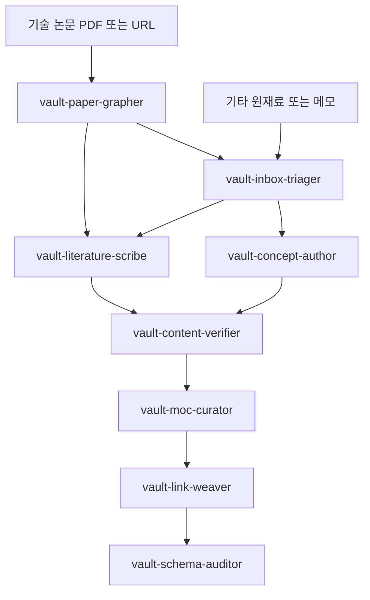

# 양자정보과학 제2의 뇌

[](https://discord.gg/9utg4hp3m8)


양자컴퓨팅, 양자정보이론, 양자-내성 암호(PQC), 양자 키 분배(QKD), 양자 알고리즘, 양자 오류 정정, 양자 하드웨어와 통신 등을 다루는 개인 지식 베이스 제 2의 뇌 입니다.

제텔카스텐(Zettelkasten)으로 개념을 원자화했고, Tiago Forte의 PARA 방법론대로 분류됐습니다.

## 사용 방법

이 저장소를 [Obsidian](https://obsidian.md) vault로 사용하세요. `.obsidian` 디렉토리 하위에는 커뮤니티 플러그인 `DataView`, `Smart Connection`, `Excalidraw`, `Highlightr` 과 그래프 뷰 관련 설정, 플러그인 연동 설정, CSS 스니펫 설정이 포함되어 있습니다.

먼서 다음 명령을 통해 저장소를 클론하세요.

```bash
$ git clone https://github.com/Quant-Off/quantum-brain.git
```

Obsidian을 열고 해당 저장소를 vault로 오픈하고, `+ Maps/` 폴더의 MOC(Map of Content) 노트에서 탐색을 시작하세요.

### Smart Connection

`Smart Connections` 플러그인은 vault 내 모든 노트를 로컬에서 임베딩 벡터로 변환하여 의미 기반 유사 노트 추천을 제공합니다. 수동으로 작성한 `related` 링크를 대체하는 것이 아니라, 아직 연결되지 않은 잠재적 관련 노트를 발견하는 보조 도구로 활용하시기 바랍니다.

임베딩은 로컬 모델 또는 OpenAI API를 통해 생성할 수 있으며, vault를 처음 열 때 전체 색인이 자동으로 빌드됩니다. 이후 노트가 추가되거나 수정될 때마다 증분 업데이트됩니다.

우측 상단의 **Connections** 아이콘 클릭 후 열린 사이드바인 **Smart Connections** 패널에서 현재 열려 있는 노트와 의미적으로 가까운 노트 목록을 실시간으로 확인할 수 있습니다.

> [!TIP]
> Smart Connection 플러그인 사용법에 관해 유튜브에서 [가이드 동영상](https://youtu.be/_i3577ti8jg)을 시청하실 수 있습니다.

### Local LLM 학습

Smart Connections의 Ollama와 LM Studio 연동은 이제 PRO 결제가 필요한 기능입니다. 무료(Transformers) 모드에서는 노트 사이의 의미적 연관성을 보여주는 용도로만 동작하고, 로컬 LLM에게 vault 전체를 읽혀 질문에 답하게 하는 일은 하지 못합니다. 외부 API 없이 vault를 로컬 LLM의 지식으로 쓰려면 별도의 무료 플러그인을 쓰는 편이 낫습니다.

여기서 말하는 "학습"은 모델 가중치를 미세조정하는 파인튜닝이 아니라, vault 노트를 임베딩으로 색인해 두고 질문 시점에 관련 노트를 검색해 답의 근거로 쓰는 RAG(검색 증강 생성)를 가리킵니다. 이 vault의 격리 우선 원칙에 맞춰, 노트를 외부로 전송하지 않고 완전히 오프라인으로 동작하는 [Copilot for Obsidian](https://github.com/logancyang/obsidian-copilot)과 [Ollama](https://ollama.com) 조합을 권장합니다. Copilot의 Vault QA는 무료 코어 기능이며, 임베딩과 채팅을 모두 로컬 Ollama 모델로 처리해 vault 내용이 기기 밖으로 나가지 않습니다.

#### 1. Ollama 설치와 모델 준비

임베딩 모델은 vault 색인용, 채팅 모델은 질의응답용입니다. Ollama 공식 웹 사이트에서 [다운로드 명령](https://ollama.com/download)을 확인하실 수 있습니다.

```bash
# Ollama 설치 (macOS)
$ curl -fsSL https://ollama.com/install.sh | sh

# 임베딩 모델 (vault 색인용)
$ ollama pull nomic-embed-text     # 더 정확한 검색을 원하면 mxbai-embed-large

# 채팅 모델 (질의응답용)
$ ollama pull qwen2.5              # mistral, llama3.2 등으로 대체 가능
```

#### 2. Obsidian 접근 허용 (CORS)

Obsidian 앱이 로컬 Ollama 서버에 접근할 수 있도록 `OLLAMA_ORIGINS`를 지정해 서버를 띄웁니다.

```bash
# macOS, Linux (터미널에서 직접 실행)
$ OLLAMA_ORIGINS=app://obsidian.md* ollama serve

# macOS 앱으로 상시 실행 중이면 환경변수 등록 후 Ollama 재시작
$ launchctl setenv OLLAMA_ORIGINS "app://obsidian.md*"
```

Windows PowerShell에서는 `$env:OLLAMA_ORIGINS="app://obsidian.md*"; ollama serve`로 실행합니다.

#### 3. Copilot 플러그인 설정

1. 커뮤니티 플러그인에서 `Copilot`을 설치하고 활성화합니다.
2. Copilot 설정에서 `Add Custom Model`로 채팅 모델을 추가합니다. 모델명은 받은 모델(예: `qwen2.5`), 공급자(provider)는 `ollama`로 지정합니다.
3. QA 설정에서 임베딩 모델로 `nomic-embed-text`, 공급자 `ollama`를 추가합니다.
4. 채팅 모드를 `Vault QA`로 바꾸면 vault 전체 색인이 자동으로 시작됩니다. 노트 수에 따라 수 분이 소요될 수 있습니다.

| 항목 | 값 |
|------|----|
| Chat Model | `qwen2.5` (provider `ollama`) |
| Embedding Model | `nomic-embed-text` (provider `ollama`) |
| API Base URL | `http://localhost:11434` |
| Chat Mode | `Vault QA` |

#### 4. vault에 질문하기

색인이 끝나면 Copilot 채팅에서 평범한 한국어로 물으면 됩니다. 예를 들어 "ML-KEM과 ML-DSA의 차이를 정리해줘"라고 입력하면, 로컬 LLM이 관련 노트를 검색해 출처와 함께 답합니다. 노트를 추가하거나 수정한 뒤에는 채팅창 위 점 3개 메뉴에서 `Refresh connections`를 눌러 색인을 갱신합니다.

임베딩과 추론이 모두 로컬에서 이뤄지므로 네트워크 없이 완전 오프라인으로 동작하며, 어떤 노트도 외부 API로 전송되지 않습니다. Copilot 외의 무료 대안으로 [Local LLM Hub](https://github.com/takeshy/obsidian-local-llm-hub), [LazyBrain](https://github.com/lazybutai/LazyBrain), [ObsidianRAG](https://github.com/Vasallo94/ObsidianRAG)도 같은 Ollama 백엔드로 vault RAG를 제공합니다.

## AI 서브에이전트

> [!TIP]
> 이 섹션의 내용은 새로운 문서를 추가하시는 경우에 참고할 수 있습니다.

이 저장소의 `agents/` 디렉토리에는 vault 운영을 자동화하는 8개의 [Claude Code](https://docs.claude.com/en/docs/claude-code) 서브에이전트가 포함되어 있습니다. 각 에이전트는 단일 책임만 지고, 작업 전에 항상 `CLAUDE.md`를 단일 진실원으로 읽은 뒤 그 규약(원자성, 프론트매터 스키마, 연결 우선, 기호 규칙)에 맞춰 동작합니다. 메인 세션이 오케스트레이터가 되어 작업 성격에 맞는 에이전트를 골라 호출하는 구조입니다.

### 설치

에이전트를 전역 또는 vault 한정으로 설치합니다.

```bash
# 전역 설치 (모든 프로젝트에서 사용)
$ cp agents/*.md ~/.claude/agents/

# vault 한정 설치
$ mkdir -p .claude/agents && cp agents/*.md .claude/agents/
```

### 에이전트 소개

- **vault-paper-grapher** 기술 논문이나 표준 문서(PDF, arXiv URL, 논문 폴더)를 graphify 지식 그래프로 변환합니다. 논문을 통째로 읽기 전에 중심 개념(God Nodes), 핵심 기여, 방법, 결과, 의외의 연결을 추출한 구조화된 다이제스트를 돌려줍니다. 이 다이제스트가 이후 문헌 노트와 개념 노트의 재료가 됩니다.
- **vault-inbox-triager** 가공 전 원재료(긴 글, 미분류 메모, 아이디어 덤프)를 원자적 개념 단위로 분해하고 PARA 기준으로 라우팅합니다. "어떤 개념 노트를 만들어야 하는가"라는 작성 계획을 산출하며, 기존 노트와 중복되는 개념은 재사용을 제안합니다. 개념 본문은 직접 쓰지 않습니다.
- **vault-concept-author** 단일 원자적 개념 노트(`type: concept`)를 작성하거나 보강합니다. 프론트매터 스키마를 정확히 채우고, 정의와 핵심과 왜 중요한가와 연결 순서의 한국어 산문을 쓰고, 수식은 LaTeX로 다이어그램은 Mermaid로 표현하며, 기존 노트와 위키링크로 잇고 `3 - Resources`의 도메인 폴더에 배치합니다.
- **vault-literature-scribe** 단일 출처(논문, 표준 문서, 책, 강의)를 요약하는 문헌 노트(`type: literature`)를 작성합니다. 출처 하나당 노트 하나를 만들고 `@저자연도` 명명 규칙과 `source` 필드를 채우며, 핵심 주장을 자신의 언어로 요약하고 관련 개념 노트와 링크합니다.
- **vault-content-verifier** 작성된 노트의 내용이 사실로서 정확한지 검증하는 게이트입니다. 기술적 진위성(표준 번호, 매개변수, 알고리즘 복잡도, 보안 가정), 수학 표기의 정확성, 개념 설명의 정확성을 점검합니다. 형식이 아니라 내용의 옳고 그름을 봅니다.
- **vault-moc-curator** MOC(Map of Content) 지식 지도를 만들고 유지합니다. `+ Maps/`에 도메인별 MOC를 생성하고, 새 개념 노트 링크를 알맞은 섹션에 추가하고, 상위 MOC가 하위 MOC를 링크하도록 계층을 정리합니다.
- **vault-link-weaver** 노트 간 연결망을 직조하고 고아 노트를 없앱니다. `up`과 `related`, 본문 위키링크, `## 연결` 섹션, aliases를 점검하고 보강하며, 링크 0개 노트를 알맞은 노트나 MOC에 매답니다. 제텔카스텐의 연결 우선 원칙을 집행합니다.
- **vault-schema-auditor** 노트가 `CLAUDE.md` 규약을 지키는지 감사하는 형식 게이트입니다. 프론트매터 스키마, 파일명과 title 일치, 태그 분류 체계, 본문 기호 규칙과 원자성, 고아(orphan) 노트를 점검하고 요청 시 안전하게 고칩니다.

`vault-content-verifier`는 내용의 옳고 그름을, `vault-schema-auditor`는 형식과 스키마를 봅니다. 두 게이트는 책임이 다르므로 내용 검증 이후 형식 감사를 돌립니다.

### 표준 작업 흐름



### 프롬프트 팁

- 메인 세션을 오케스트레이터로 두고 의도만 주면 됩니다. "이 논문을 vault에 정리해줘"처럼 목표를 말하면 적절한 에이전트가 자동으로 선택됩니다.
- 특정 에이전트를 직접 부르려면 이름을 명시합니다. 예를 들어 "vault-concept-author로 ML-KEM 개념 노트를 작성해줘"라고 지시합니다.
- 입력 종류로 시작점을 고릅니다. 논문이나 표준 문서는 `vault-paper-grapher`부터, 일반 메모나 아이디어 덤프는 `vault-inbox-triager`부터 넣습니다.
- 작성할 개념이 명확한 단일 개념 하나면 분해 단계를 건너뛰고 `vault-concept-author`를 바로 호출해도 됩니다.
- 노트를 작성한 뒤에는 `vault-content-verifier`로 내용을 검증하고 `vault-schema-auditor`로 형식을 감사합니다. 내용 게이트와 형식 게이트의 역할을 분리해 차례로 돌립니다.
- 노트를 대량으로 추가하거나 변경한 뒤 고아 노트가 의심되면 `vault-link-weaver`로 연결을 보강합니다.
- 모든 에이전트는 작업 전에 `CLAUDE.md`를 읽습니다. vault 규약을 `CLAUDE.md` 한 곳에서 관리하면 모든 에이전트 동작이 일관되게 유지됩니다.
- 격리 우선 원칙에 따라 논문 본문이나 미공개 내용을 외부 API로 보내지 않는 로컬 처리가 기본입니다. 외부 추출이나 조회가 필요하면 에이전트가 먼저 확인합니다.

이러한 작업은 에이전트가 [AGENTS.md](AGENTS.md) 지침에 의해 능동적으로 수행할 수도 있습니다. Claude Code의 경우, `/deep-research` 명령과 동적 워크플로, 에이전트 뷰 기능을 적절히 활용할 수 있습니다.

예를 들어, "MOC - Post-Quantum Cryptography" MOC에 포함될 새로운 프로젝트를 생성하고자 한다면 "MOC - Post-Quantum Cryptography에 연결될 SLH-DSA 양자-내성 암호화의 내부적 연산 과정 문서를 집필해줘. 집필하기 위해 지침에 명시된 에이전트를 적극 활용해." 이와 함께 관련 논문을 제공할 수 있습니다.

> [!TIP]
> 집필 작업이 완료된 이후 에이전트가 "집필된 내용을 검증할까요?"와 같이 묻습니다. 이 작업은 컨텍스트 클리어 후 진행하거나 별도의 세션에서 진행하는 편이 권장됩니다.