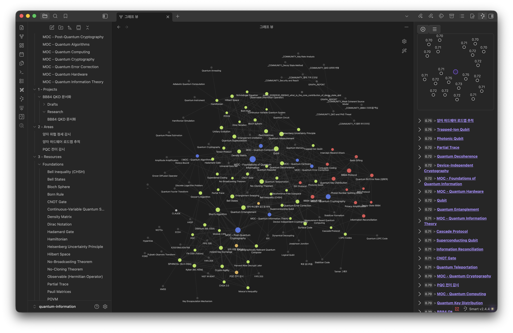

# 양자정보과학 제2의 뇌

양자컴퓨팅, 양자정보이론, 양자-내성 암호(PQC), 양자 키 분배(QKD), 양자 알고리즘, 양자 오류 정정, 양자 하드웨어와 통신 등을 다루는 개인 지식 베이스 제 2의 뇌 입니다.

제텔카스텐(Zettelkasten)으로 개념을 원자화했고, Tiago Forte의 PARA 방법론대로 분류됐습니다.

## 사용 방법

이 저장소를 [Obsidian](https://obsidian.md) vault로 사용하세요. `.obsidian` 디렉토리 하위에는 커뮤니티 플러그인 `DataView`, `Smart Connection`, `Excalidraw`, `Highlightr` 과 그래프 뷰 관련 설정, 플러그인 연동 설정, CSS 스니펫 설정이 포함되어 있습니다.

먼서 다음 명령을 통해 저장소를 클론하세요.

```bash
$ git clone https://github.com/Quant-Off/quantum-brain.git
```

Obsidian을 열고 해당 저장소를 vault로 오픈하고, `+ Maps/` 폴더의 MOC(Map of Content) 노트에서 탐색을 시작하세요.

### Smart Connection

`Smart Connections` 플러그인은 vault 내 모든 노트를 로컬에서 임베딩 벡터로 변환하여 의미 기반 유사 노트 추천을 제공합니다. 수동으로 작성한 `related` 링크를 대체하는 것이 아니라, 아직 연결되지 않은 잠재적 관련 노트를 발견하는 보조 도구로 활용하시기 바랍니다.

임베딩은 로컬 모델 또는 OpenAI API를 통해 생성할 수 있으며, vault를 처음 열 때 전체 색인이 자동으로 빌드됩니다. 이후 노트가 추가되거나 수정될 때마다 증분 업데이트됩니다.

우측 상단의 **Connections** 아이콘 클릭 후 열린 사이드바인 **Smart Connections** 패널에서 현재 열려 있는 노트와 의미적으로 가까운 노트 목록을 실시간으로 확인할 수 있습니다. 

### Local LLM 학습

외부 API 없이 로컬 LLM으로 임베딩을 생성하려면 [Ollama](https://ollama.com)를 사용할 수 있습니다.

먼저 Ollama 설치 및 모델을 준비하세요.

```bash
# Ollama 설치 (macOS)
$ brew install ollama

# 임베딩 모델 pull
$ ollama pull nomic-embed-text

# 채팅 모델 pull (Smart Connections Chat 기능 사용 시)
$ ollama pull llama3.2
```

이후 Smart Connections 설정을 진행하세요. Obsidian 설정에서 **Smart Environment** -> **Embedding models** 섹션에서 모델을 설정할 수 있습니다. (단, LM Studio, Ollama, OpenAI 등을 설정하기 위해선 PRO 등록이 필요합니다. 기본값은 Transformers 입니다.)

| 항목 | 값 |
|------|----|
| Embedding Model | `Ollama` |
| Model Name | `nomic-embed-text` |
| API Base URL | `http://localhost:11434` |

**3. 전체 색인 재빌드**

설정 변경 후 **Smart Connections > Rebuild Index**를 실행하면 vault 내 모든 노트가 로컬 모델로 재임베딩됩니다. 노트 수에 따라 수 분이 소요될 수 있습니다.

이후 추가되거나 수정된 노트는 자동으로 증분 업데이트되므로 별도 작업이 필요하지 않습니다.

